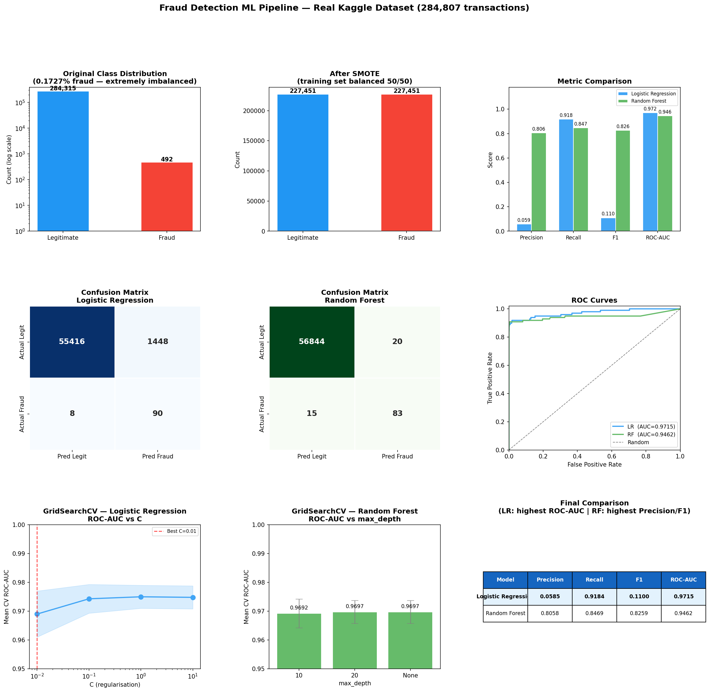

# Task-2-Anubhav_Singh
## Fraud Detection Machine Learning Pipeline

A supervised ML pipeline for detecting fraudulent credit card transactions in a highly imbalanced real-world dataset. Implements SMOTE for class balancing, trains Logistic Regression and Random Forest inside leak-proof `imblearn` Pipelines, tunes hyperparameters with `GridSearchCV`, and evaluates using Precision, Recall, F1-score, ROC-AUC, and Confusion Matrix.

---

## Dataset

**Kaggle Credit Card Fraud Detection**  
Source: https://www.kaggle.com/datasets/mlg-ulb/creditcardfraud  
File: `creditcard.csv` (144 MB — not committed to repo; see Setup below)

| Property | Value |
|---|---|
| Total transactions | 284,807 |
| Fraudulent | 492 (0.1727%) |
| Legitimate | 284,315 (99.8273%) |
| Features | V1–V28 (PCA-anonymised), Time, Amount |
| Target | `Class` (0 = Legitimate, 1 = Fraud) |
| Missing values | None |

---

## Project Structure

```
Task-2-Anubhav_Singh/
│
├── fraud_detection_pipeline.py   # Full ML pipeline (main script)
├── requirements.txt              # Python dependencies
├── .gitignore                    # Excludes creditcard.csv and artifacts
├── fraud_detection_results.png   # 9-panel results dashboard
└── README.md                     # This file
```

---

## Problem Statement

Credit card fraud detection is a canonical imbalanced classification problem. With only 0.17% of transactions being fraudulent, a classifier that predicts "Legitimate" for every single transaction achieves **99.83% accuracy** while catching **zero fraud cases**. Accuracy is therefore a completely misleading metric for this problem.

This pipeline addresses class imbalance correctly via SMOTE and evaluates models exclusively on metrics that reflect real fraud detection capability.

---

## Workflow

### 1. Data Exploration
- Load `creditcard.csv` and inspect shape, dtypes, and missing values
- Analyse class distribution — confirms extreme imbalance (1 : 578 ratio)
- Review Amount and Time feature statistics

### 2. Train/Test Split — before SMOTE
```python
X_train, X_test, y_train, y_test = train_test_split(
    X, y, test_size=0.2, stratify=y, random_state=42
)
# Train: 227,845 rows | Fraud: 394
# Test :  56,962 rows | Fraud:  98
```
Stratified split preserves the class ratio. Splitting **before** SMOTE is mandatory — applying SMOTE first lets synthetic minority samples generated from training neighbours leak into the test set, inflating all reported metrics.

### 3. SMOTE — training data only
```python
from imblearn.over_sampling import SMOTE
smote = SMOTE(random_state=42)
X_train_smote, y_train_smote = smote.fit_resample(X_train, y_train)
# Result: 227,451 Legitimate | 227,451 Fraud (balanced 50/50)
```
SMOTE generates synthetic fraud samples by interpolating between existing minority class instances in feature space.

### 4 & 5. Pipelines
`imblearn.pipeline.Pipeline` is used instead of sklearn's Pipeline because it natively supports resamplers as pipeline steps, ensuring SMOTE runs inside each CV fold during GridSearchCV — not once on the full training set.

**Logistic Regression pipeline:**
```
StandardScaler → SMOTE → LogisticRegression(class_weight='balanced')
```

**Random Forest pipeline:**
```
SMOTE → RandomForestClassifier
```
Tree-based models are scale-invariant, so StandardScaler is omitted from the RF pipeline.

### 6. Hyperparameter Tuning — GridSearchCV

`scoring='roc_auc'` is used because ROC-AUC is threshold-independent and directly measures ranking quality — appropriate when the optimal decision threshold isn't known at tuning time.

**Logistic Regression:**
```python
param_grid = {"classifier__C": [0.01, 0.1, 1, 10]}
# Best: C = 0.01 | CV ROC-AUC = 0.9750
```

**Random Forest:**
```python
param_grid = {"classifier__max_depth": [10, 20, None]}
# Best: max_depth = 20 | CV ROC-AUC = 0.9697
```

### 7. Evaluation

Accuracy is excluded. All metrics are computed on the held-out test set (never seen during training or tuning).

| Metric | What it captures |
|---|---|
| **Precision** | Of all transactions flagged as fraud — how many actually are |
| **Recall** | Of all actual fraud cases — what fraction the model caught |
| **F1-score** | Harmonic mean of Precision and Recall |
| **ROC-AUC** | Model's ability to rank fraud above legitimate at every threshold |
| **Confusion Matrix** | Raw counts of TP, TN, FP, FN |

---

## Results

Evaluated on **56,962 test transactions containing 98 actual fraud cases**.

| Model | Precision | Recall | F1 | ROC-AUC |
|---|---|---|---|---|
| Logistic Regression | 0.0585 | **0.9184** | 0.1100 | **0.9715** |
| **Random Forest** | **0.8058** | 0.8469 | **0.8259** | 0.9462 |

### Results Dashboard



### Conclusion

There is no single winner — each model makes a different trade-off:

**Logistic Regression** achieves the highest ROC-AUC (0.9715) and Recall (0.9184), catching 90 out of 98 fraud cases. However, its Precision is only 0.06 — meaning it fires **1,448 false alarms** alongside those 90 catches. This would overwhelm any human review team.

**Random Forest** achieves far superior Precision (0.8058) and F1 (0.8259). It catches 83 out of 98 fraud cases while generating only **20 false alarms** — an 83× reduction in false positives compared to Logistic Regression. This is more operationally viable for production fraud systems with a limited review queue.

**Recommendation:** Random Forest is the better production model. In deployment, the decision threshold can be tuned downward if higher recall is required, trading some precision for more fraud catches depending on the business cost of missed fraud versus false alerts.

---

## Setup & Usage

### Prerequisites
- Python 3.8+
- `creditcard.csv` from [Kaggle](https://www.kaggle.com/datasets/mlg-ulb/creditcardfraud)

### Installation
```bash
git clone https://github.com/<your-username>/Task-2-Anubhav_Singh.git
cd Task-2-Anubhav_Singh
pip install -r requirements.txt
```

### Download the dataset
```bash
# Option 1: Kaggle CLI
pip install kaggle
kaggle datasets download -d mlg-ulb/creditcardfraud
unzip creditcardfraud.zip

# Option 2: Download manually from
# https://www.kaggle.com/datasets/mlg-ulb/creditcardfraud
# and place creditcard.csv in the project root
```

### Run
```bash
python fraud_detection_pipeline.py
```

Output: step-by-step console log + `fraud_detection_results.png` saved in current directory.

---

## Dependencies

| Package | Version | Purpose |
|---|---|---|
| `scikit-learn` | ≥1.3.0 | Models, GridSearchCV, metrics, split |
| `imbalanced-learn` | ≥0.11.0 | SMOTE, imblearn Pipeline |
| `pandas` | ≥2.0.0 | Data loading and manipulation |
| `numpy` | ≥1.24.0 | Numerical operations |
| `matplotlib` | ≥3.7.0 | Visualisation |
| `seaborn` | ≥0.12.0 | Confusion matrix heatmaps |

---

## Key Design Decisions

**Why `imblearn.pipeline.Pipeline` over `sklearn.pipeline.Pipeline`?**  
sklearn's Pipeline does not support resamplers as steps — calling `fit_resample` inside a CV fold requires imblearn's pipeline. This ensures SMOTE is applied only to the training portion of each fold, never to the validation portion.

**Why `roc_auc` as the GridSearchCV scoring metric?**  
ROC-AUC is threshold-independent, making it appropriate for hyperparameter selection when the deployment threshold isn't fixed. F1 assumes a 0.5 threshold, which is rarely optimal for imbalanced problems.

**Why `class_weight='balanced'` on Logistic Regression?**  
Acts as a secondary guard against imbalance on top of SMOTE. It inversely weights classes by frequency in the loss function, further penalising fraud misclassification.

**Why is `creditcard.csv` not committed to the repo?**  
The file is 144 MB (exceeds GitHub's 100 MB limit) and is subject to Kaggle's dataset terms. The `.gitignore` excludes it. Users download it directly from Kaggle.

---

## Author

**Anubhav Singh**
